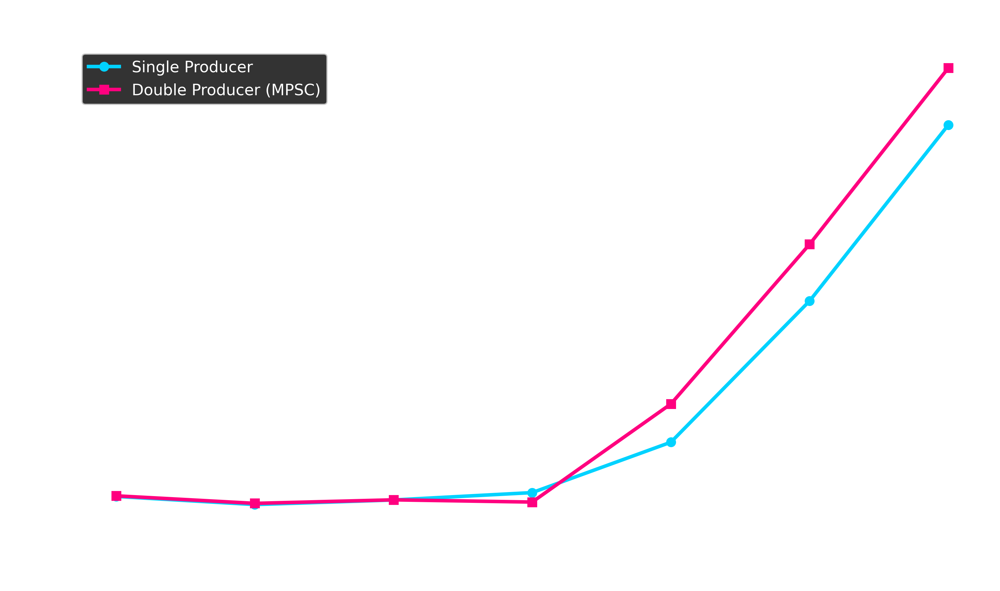
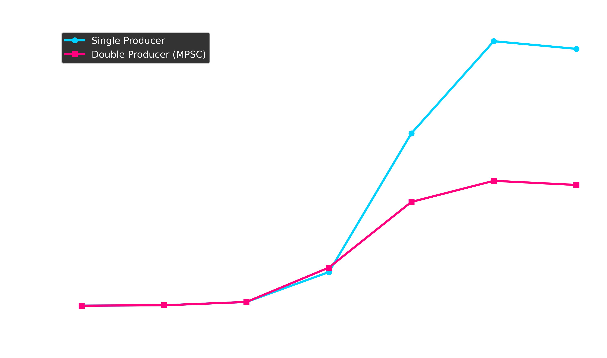

# High-Frequency Limit Order Book Engine

A high-performance, multi-threaded Limit Order Book (LOB) matching engine written in C++. Designed for High-Frequency Trading (HFT) simulation, this engine utilizes a lock-free Multiple-Producer Single-Consumer (MPSC) architecture to process millions of concurrent orders at microsecond latencies without OS-level thread contention.


## Table of Contents
1. [Architecture & Features](#architecture--features)
2. [Performance Benchmark](#performance-benchmark)
3. [Quick Start](#quick-start)
4. [Project Structure](#project-structure)


## Architecture & Features

* **Lock-Free MPSC Ring Buffer:** Network and producer threads push orders into the engine concurrently without utilizing slow, blocking OS-level mutex locks. Buffer slots are padded and aligned to 64-byte CPU cache lines to completely eliminate false sharing.
* **Heap-Allocated Thread-Local Memory Pooling:** Completely bypasses standard OS memory allocation (`new`/`delete`) during live runtime. Producers use pre-allocated Memory Pools on the Heap to ensure zero allocation overhead during live trading simulations.
* **O(1) Order Matching:** The core Limit Order Book bypasses traditional tree structures in favor of deeply optimized doubly-linked lists intertwined with 2-level bitwise indexing to find the best Bid/Ask prices instantly.
* **Inverted Threading Model:** Producers run on isolated background threads, allowing the central Limit Order Book matching engine to monopolize the main CPU thread for uninterrupted, maximum-throughput execution.


## Performance Benchmark

The following data represents local hardware benchmarks running randomized payloads into a single Limit Order Book Consumer. The tests were conducted using both a **Single Producer** (testing raw sequential throughput) and a **Double Producer** (testing lock-free MPSC concurrency). 

The engine successfully scales to **~23.4 million orders per second** during single-producer insertion and maintains a massive **~11 million orders per second** under heavy multi-thread contention.

### Single Producer
| Total Orders | Execution Time (ms) | Throughput (Orders / Sec) |
| :--- | :--- | :--- |
| 10 | 3.187 | 3,137.55 |
| 100 | 2.861 | 34,958.92 |
| 1,000 | 3.040 | 328,914.91 |
| 10,000 | 3.352 | 2,983,471.56 |
| 100,000 | 6.539 | 15,292,390.50 |
| 1,000,000 | 42.539 | 23,478,973.40 |
| **10,000,000** | **438.585** | **22,800,586.97** |

### Double Producer (MPSC Contention Test)
| Total Orders | Execution Time (ms) | Throughput (Orders / Sec) |
| :--- | :--- | :--- |
| 10 | 3.213 | 3,112.16 |
| 100 | 2.907 | 34,404.45 |
| 1,000 | 3.046 | 328,353.30 |
| 10,000 | 2.957 | 3,382,263.41 |
| 100,000 | 10.859 | 9,209,290.33 |
| 1,000,000 | 90.213 | 11,084,913.76 |
| **10,000,000** | **932.976** | **10,718,391.62** |






## Quick Start

### Prerequisites
To compile and run this engine, your system must have:
* **C++ Compiler:** Must support **C++17** or higher (GCC, Clang, MSVC, or MinGW).
* **CMake:** Version **3.10** or higher.
* **Git:** For version control.

### Build & Run

**1. Clone the repository:**
```bash
git clone https://github.com/Akshar-7/Limit_Order_Book_Engine.git
cd Limit-Order-Book-Engine
```

**2. Generate build files**
```bash
cmake -B build
```

**3. Compile with maximum optimizations**
```bash
cmake --build build --config Release
```

**4. Run the engine**

Depending on the compiler CMake auto-selected for your system, the executable location will vary slightly:

Windows (MinGW / Makefiles):
```bash
.\build\Limit_Order_Book_Engine.exe
```

Windows (Visual Studio / MSVC):
```bash
.\build\Release\Limit_Order_Book_Engine.exe
```

Linux / macOS:
```bash
./build/Limit_Order_Book_Engine
```


## Project Structure

* **`main.cpp`** - The entry point of the application, responsible for configuring and launching the benchmark cycles.
* **`benchmark.cpp` & `benchmark.h`** - The multithreaded benchmarking suite. Handles the thread spin-ups, Producer/Consumer isolation, workload splitting, and precise execution timing.
* **`limit_order_book.h`** - The core matching logic. Contains the bitwise price-level arrays and the `process()` matching. 
* **`MPSC_ring_buffer.h`** - The hardware-aligned, lock-free queue that safely passes memory pointers from multiple producers to the main engine.
* **`memory_pool.h`** - The custom memory management blueprint. Allocates continuous blocks of RAM on the Heap to bypass runtime allocation delays.
* **`order.h`** - The baseline structural definitions for financial Orders.
* **`CMakeLists.txt`** - The build configuration file that links the project files, manages thread libraries, and lifts the default memory limits.
